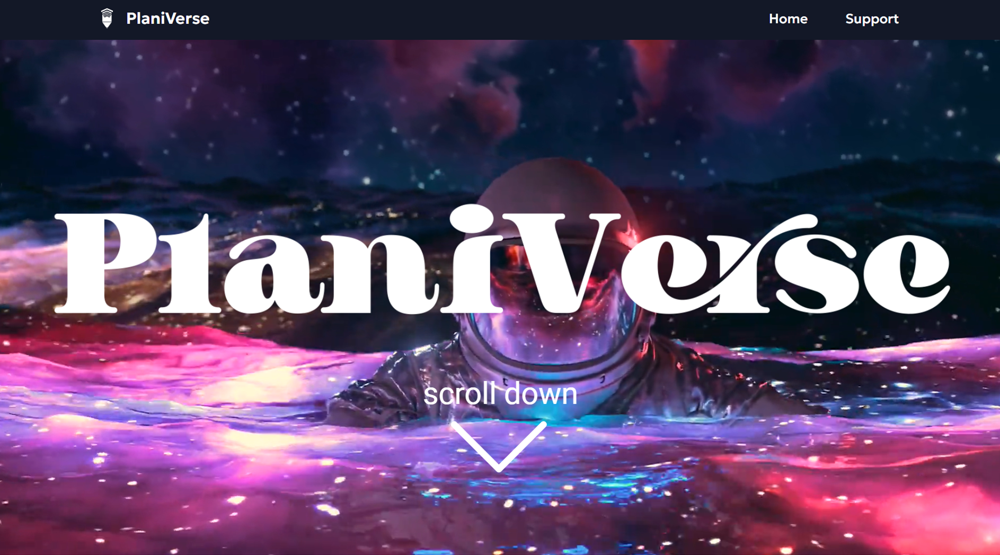
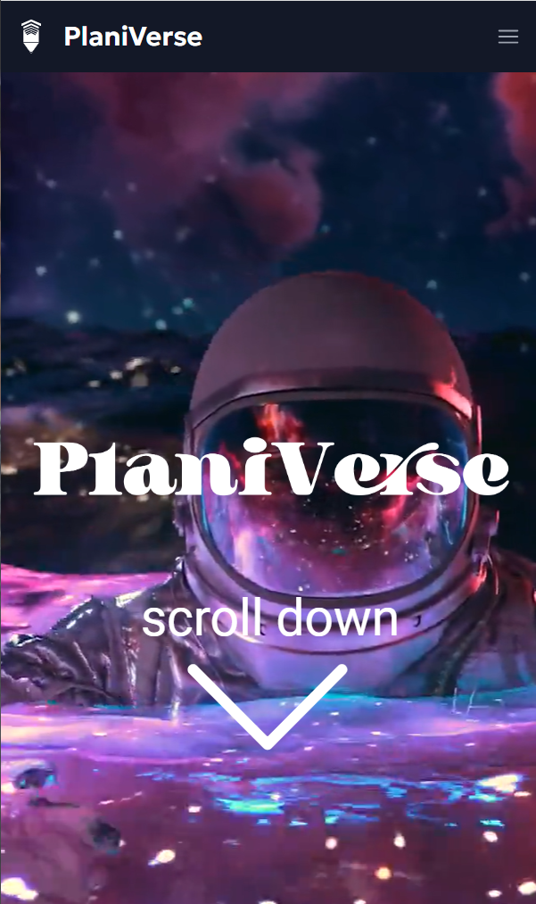

# PlaniVerse | An Event Planning App (Front-End)

  
  

PlaniVerse is the third project I created at <a href="https://perscholas.org/courses/software-engineer/software-engineer-atlanta/">Per Scholas'</a> Software Engineer Training program using the <a href="https://www.mongodb.com/mern-stack">MERN </a> stack. It is an event planning responsive app in which the user, i.e. an event planner, is able to do all four <a href="https://www.mongodb.com/basics/crud">CRUD</a> operations. More specifically, an event planner is able to create, display, update, and delete an event. The <a href="https://github.com/Th876/EventPlanning-FrontEnd">frontend</a> and <a href="https://github.com/Th876/EventPlanning-BackEnd">backend</a> are created in two separate GitHub repositories. This is the <a href="https://event-planning-frontend.onrender.com/">live link</a> for my MERN Application.

<h3>Technologies Used</h3>
<ul>
<li><a href="https://www.mongodb.com/mern-stack">MERN</a></li>
<li><a href="https://vitejs.dev/">Vite</a></li>
<li>React Library: <a href="https://react.dev/learn/writing-markup-with-jsx">JSX</a> and <a href="https://react.dev/">React.js</a>
<li><a href="https://developer.chrome.com/docs/devtools/open/">Chrome DevTools</a></li>
<li><a href="https://tailwindcss.com/">Tailwind CSS</a></li>
<li><a href="https://headlessui.com/">Headlessui</a></li>
<li><a href="https://fonts.google.com/">Google fonts</a></li>
<li><a href="https://www.youtube.com/">YouTube</a></li>
<li><a href="https://render.com/">Render</a></li>
<li><a href="https://docs.google.com/">Google Docs</a></li>
<li><a href="https://code.visualstudio.com/">Visual Studio Code</a></li>
<li><a href=https://www.adobe.com/products/illustrator.html">Adobe Illustrator</a></li>
<li><a href="https://www.adobe.com/products/photoshop.html">Adobe Photoshop</a></li>
<li><a href="https://www.freepik.com/">Freepik</a></li>
</ul>

<h3>Wireframe</h3>

<h3>Getting Started</h3>

This is the <a href="https://event-planning-frontend.onrender.com/">live link</a>.

This is the <a href="https://github.com/Th876/EventPlanning-BackEnd">backend's repository link</a>.

<h3>Future Enhancements</h3>

In the future, I would like to:

<ul>
<li> Add a feature that allows the event planner to edit each event card’s image to reflect the type of event.</li>
<li> Incorporate a mood board so that the event planner can have multiple images for inspiration for each event. The event planner would be able to retrieve images from their personal computer or the internet.</li>
<li>User authentication so that the event planner’s information is secure </li>
<li>A live chat feature in which the event planner can communicate directly with clients.</li>

<h3>Getting Started with Vite</h3>

This project was created with [Vite](https://vitejs.dev/).

<h4>Available Scripts</h4>

In the project directory, you can run:

### `npm run dev`

Runs the app in the development mode.\
Open [http://localhost:5173/](http://localhost:5173/) to view it in your browser.

The page will reload when you make changes.\
You may also see any lint errors in the console.

## Learn More

You can learn more in the [Vite documentation](https://vitejs.dev/guide/).

